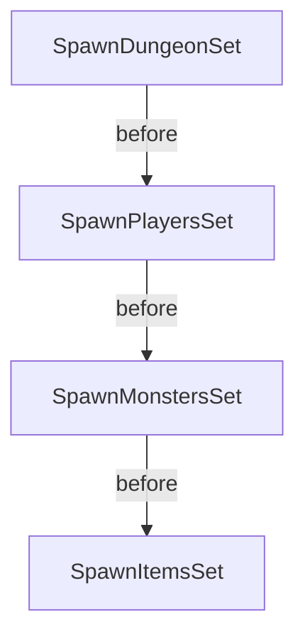
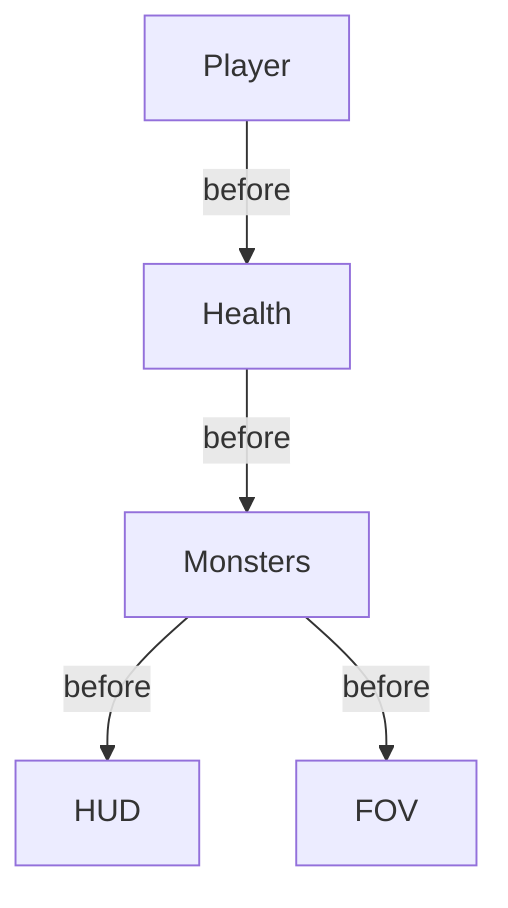

# Dungeon Crawl **P2P**

Goal is to recreate dungeon crawl in Bevy (using Bevy rendering etc) that works on web and Mac OS and that can be with 2 players. (Unlike original, this one is NOT turn-based (for better or worse).

## Running

Not meant for public use.
Hosted at [http://3.147.199.67/](http://3.147.199.67/).

## Developing

### To run in Single Player Mode (with bacon)

`cargo run`

(Or kick off debug session in VS Code/Cursor)

### To run in MultiPlayer Mode (2 players)

First, in a different terminal window:
`matchbox_server`

(Note: [matchbox](https://github.com/johanhelsing/matchbox/tree/main) must have been previously installed via cargo install matchbox_server.)

Then:

`bacon run-web`

## TODO

Focusing on generating the map for now. Assume it will become a resource.
But for now, lets generate walls vs floors (just diff color boxes for now).
And lets create the diff room architects. We can add exit and amulet and player.

- [ ] cellular automata dungeon generation
  - [x] Ensure periphery is all walls
  - [x] Position players in single and multi player. Pick 2 random corners and put the player on closest floor tile. (There is a chance it will be isolated so later on we want to ensure path to center where we will put amulet)
  - [x] Randomly choose dungeon builder
  - [ ] Document (and rationalize) DungeonPosition vs MapPos vs iVec2
  - [ ] refactor
    - [ ] find nearest floor tile should only search perimeter
  - [ ] spawn_dungeon: should use insert_batch as that is more efficient
- [ ] drunkard walk dungeon generation
- [ ] prefab dungeon sections
- [ ] stairs and dungeon levels
  - [ ] show level in HUD
- [ ] player sprites
- [ ] monster sprites
- [ ] tile sprites
  - [ ] note wall tiles are currently always hidden. will need to adjust `recalculate_fov`
- [ ] upgrade to rand 0.9. It has breaking changes and Xoshiro
- [ ] improve lighting simulation
- [ ] amulet. In original it is placed farthest from player. But we now have 2 randomly placed players.
  - [ ] Game won state and screen
- [ ] monsters now move intentionally, but still not very smart. If they see any players, they will hone in on the closest one and take any valid step that brings them closer to that player, but it is a shortsighted strategy since the distance to the player does not account for any obstacles, so there's probably situations where going to a farther player would be better or where stepping further first is a better path. In other words, there's no path-finding like Dikjstra path. They also have no memory so they will stop chasing a player who escapes their FOV like just around a corner. See [Dijkstra Maps](https://www.roguebasin.com/index.php/The_Incredible_Power_of_Dijkstra_Maps) for an implementation of the algorithm in the context of a rogue-like dungeon crawler. I think this is what the Hands-On Rust book used.
- [ ] restart game on game over key press. And actual game over systems and display
- [ ] dungeon themes
- [ ] score points for defeating monsters, picking up coins ?
- [ ] monster patrol strategies (explore, guard, rest)
- [ ] worth looking at [Leafwing input manager](https://github.com/Leafwing-Studios/leafwing-input-manager) for keyboard input handling (and mouse)
  - [ ] The player movement throttling can probably be simplified by resetting the key press, or using logic like monster throttling, of perhaps Leafwing makes this simpler.
- [x] magic map
  - [x] rename RevealDungeonCheatEvent etc to RevealDungeonEvent and have it work in cheat mode vs magic item mode. It magic item mode, map only revealed to one player

## Issues

- [ ] Browser tab title

## Deploying

See [Deploying](./static/README.md)

## Main Modules

- `common`: Functionality shared among multiple other modules:
  - `fov`: Field of view calculations
  - `health`: Health, healing, damage
  - `random_generator`: Random number generation
  - `events`: Events not clearly associated with any other module (e.g. DesyncEvent, SnapshotStateEvent)
- `dungeon`: Dungeon generation and map
- `game_states`: The GameState enum and the game_over system
- [HUD](./src/hud/README.md): Heads-up display, including health bar and tooltips
- `items`: Items that the player can grab and add to their inventory and use later
- `monsters`: Monsters and their actions
- [Player](./src/player/README.md).
- [startup](./src/startup/README.md), including GGRS for multiplayer

### System Sequencing

The `GameState::InGame` state is by far the most complex.

#### OnEnter(GameState::InGame)

It is helpful to be deterministic in the order of entity spawning when debugging GGRS. Below is the sequence of system sets that run when entering the `GameState::InGame` state:

Note that HUD elements spawn in `GameState::Startup`, well before `GameState::InGame`.

#### GameState::InGame Main Loop

The `GameState::InGame` is handled differently in `GameMode::SinglePlayer` vs `GameMode::P2P` (or `GameMode::SyncTest`). In single player mode, the systems run in the `Update` schedule while in P2P mode, they run in the `GgrsSchedule` schedule (plus a special ReadInputs schedule for handling inputs from both the local and remote players).

The sequencing is also non-trivial and diagrammed below:

- Health controls both time-based healing as well as healing from drinking a potion. For simplicity, we run them in the same set after the player actions (e.g. use healing potion) and before monster actions. This is mainly to ensure all healing happens in the same frame. (There's probably a better way to do this.)
- Player systems run before monsters to give them a theoretical advantage.
- Monster systems run before HUD and FOV.
- HUD and FOV run last can can run in parallel, but they must follow monster, player and health systems. FOV is affected by player and monster movements. HUD is affected by player health and actions (including updates to the player's inventory).

- Dungeon systems just control the dungeon reveal and map zoom level so they can run in parallel with everything else.

## Archived TODO

- [x] simplify player inputs
- [x] re-enable snapshots
- [x] should we add/remove PlayerMovement component instead? More generally, the throttle is weird as it is only reset when there is a move. it should reset also when key is released?
- [x] simplify intersects on player moves. check against monster moves
- [x] set game mode to p2p for wasm by default and sp otherwise
- [x] monster attack player. For now, it just transitions to GameOver which simply logs out game over. What should happen in p2p mode? Respawn dead player?
- [x] Maintain single list of systems for player/monster actions. Not sure how best to do this. Something like defining an array/tuple of the set of systems that are the same between GgrsSchedule and Update. Quick dialog w/ copilot suggests a macro. But it is ugly. Perhaps combine a single do_player_action which internally branches based on GAME_MODE? This way the tuple is the same and can be defined as a var that can be used in both places, if the borrow checker allows? Or maybe have an add_systems that selects the GgrsSchedule vs Update based on GAME_MODE?
- [x] prevent players from moving onto each other (no attacks yet)
- [x] Health component and give player 10
  - [x] Elapsed time healing
  - [x] synctest.
- [x] health bar
- [x] player FOV
- [x] monster follows player
  - [x] FOV contains hash set of positions (or hashmap of position to tile entity)
  - [x] monster FOV
  - [x] MonsterActionDeterminer.plan_move. move towards any player it can see, otherwise move randomly
    - [x] Slow down the monster move to attack
    - [x] chase move needs to avoid invalid moves
- [x] deal monster-based damage to players
- [x] heal monsters
- [x] hide unexplored dungeon
- [x] hide monsters outside FOV
- [x] how to enable trace logging only for my app (or per module)
- [x] tunnel between rooms
- [x] zoom in/out in dungeon or scroll (or both)
- [x] camera should have its own system
- [x] set up p2p
- [x] spawn player
  - [x] players can spawn off map. Probably rooms can be off map
- [x] player input
  - [x] collision detection
- [x] camera follows player
- [x] May need to allow finer movement adjustments if player is as wide as a tile so they can easily enter corridors
- [x] GGRS sync stuff
  - [x] Event handling
  - [x] Ensure we have rollbacks registered
- [x] single player mode
- [x] spawn monsters
- [x] monster random moves (w/o stepping on other monster)
  - [x] adapt to multi player
- [x] player attack on monster
  - [x] adapt to multi player
  - [x] getting desyncs. Note there is a bug in desync detection, but I am pretty sure I have my own bugs because I see visually things going out of sync. It happens even if i do not despawn monsters. Even registering Time does not solve it. Hmm...
- [x] text on health bar
  - [x] health to left
  - [x] health points x/10 to right
  - [x] update health points text
  - [x] use custom font on both web and mac
  - [x] re-arrange to have parent container with text and bars as children
  - [x] center the whole thing
  - [x] experiment using UI instead of sprites/transforms
- [x] tool tips to show monster name and health
  - [x] only show when monster is in player's FOV
  - [x] Do we want to show current health on monster or max? Showing max for now
- [x] map revealer debug key
- [x] zoom in/out
  - [x] HUD should not change. Does this mean a different camera or?
- [x] only show other player when in FOV
- [x] reorg game project to be feature based. core, player, monster, dungeon, etc...
  - [x] Look into plugins. Probably each top module should be a plugin that adds systems, events etc
- [x] reorg cleanup
  - [x] events plugin for all relevant modules in events mod
  - [x] system sets x-ref to each other
  - [x] Helper for core_systems
- [x] healing potions
  - [x] toggle visibility. It just worked! Nice!
  - [x] grab item
  - [x] test with sync. Likely need rollback for this.
  - [x] Issue with G key detection. Seems like you have to hit it multiple times. This only seems to happen on multi-player wasm, but not on single player wasm nor on mac either single or multi player. It fails to register right at the just_released. Changing from just_released to pressed does the trick.
- [x] inventory and item usage
  - [x] press 1-9 to use inventory item
  - [x] update system flow diagram as needed
  - [x] refactor inventory systems
  - [x] refactor grab_item system
  - [x] document single_press stuff in player_action and refer to readme
  - [x] refactor use_item system
  - [x] we have sync issues again, but only in multi-player (not sync test)
  - [x] updating inventory does not work in sync test. It only keeps one item in inventory and it cannot be selected via mouse nor key. Issue was that I forgot to add the Rollback component to items!
  - [x] Why is player 0 always visible to player 1 now?!?
  - [x] respond to mouse click on inventory title to toggle too. Interesting to see how to handle mouse inputs. But may still defer.
- [x] data driven dungeon monsters and items
  - [x] items
  - [x] monsters
- [x] weapons
  - [x] 3 sword types spawned randomly (as item types). From data file
  - [x] grab feature. Replaces exiting weapon rather then adding to inventory. Display in HUD to right of health bar (for now)
  - [x] apply xtra damage based on weapon
  - [x] think hud layer needs fixing so text is always on top of health bar and panel
- [x] display item tool tip when standing over it
  - [x] BUG: showing tooltip on entity out of FOV (still bit of a rounding error when item is just outside FOV, but good enough)
  - [x] BUG: on_player_move: local player Hide even though inactive tooltip
  - [x] BUG: hit test of mouse is off. zoom in and move over item to fine tune
  - [x] BUG: zooming should hide tooltip
  - [x] consider breaking up toggle_trigger into diff mods
  - [x] log to confirm when event trigger systems fire
  - [x] refactor player movement
  - [x] try out the on event check for system.
  - [x] Maybe the trigger observer stuff? https://taintedcoders.com/bevy/events
  - [x] reusable fn to detect if tooltip is active: local player move,
  - [x] create tooltip plugin
  - [x] document tooltips
  - [x] test in p2p and synctest
  - [x] Consider using entity pos for mouse tooltip. Then both tooltips could be the same. But need to figure out how to convert from game to hud coordinates
  - [x] deploy such that it can be used across devices (ideally over internet)

### Archived Issues

- [x] synctest mode does not work. It spawns the 2 players, but they are not seen in the GgrsSchedule systems (move_players and camera_follow). Solved by starting sync test when entering the MatchMaking state rather than in the Update. See commit 6dfacc59a686f72e3ac49ac957130c72407bb7f0.
- [x] matchbox does not work with bevy 0.15, unless using fork from haihala. Hope to get revised bevy_ggrs and matchbox once [PRs](https://github.com/johanhelsing/matchbox/pull/466) merged
- [x] Fix zoom on web where key press detection is inconsistent
- [x] If you move the mouse on mac app right when it is starting, it crashes.
