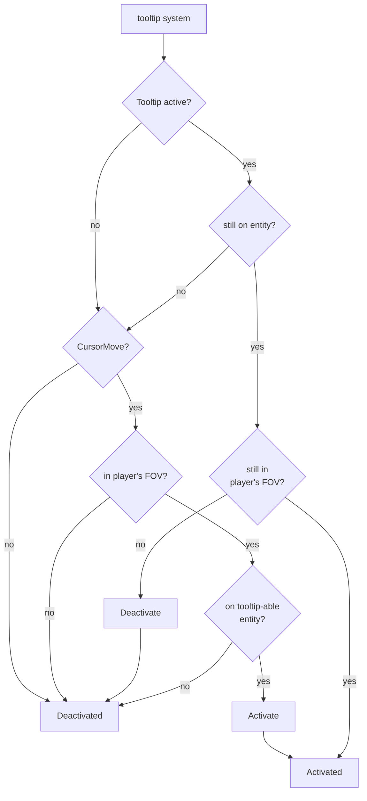

# HUD

The HUD at this point is just the a bar at the top. It is rendered using Bevy UI, so it uses screen coordinates rather than world coordinates. And it uses `Display::Flex` as the layout manager. This all makes it really easy to display text and the health bar and align them etc.

Noteworthy is that it uses a different camera, the `HudCamera`. This ensures any scaling, movement etc on the `PlayerCamera` does not affect the `HudCamera`. They render to different `RenderLayers` with the HUD camera having a higher order. (In fact, Bevy UI defaults to rendering on the highest layer, but we specify the render layer anyway to be more explicit and clear how the HUD relates to the HudCamera.)

## Tooltip

The system to display a [tooltip](./tooltips.rs) is non-trivial. Here is the decision flowchart:

Notes:

- An entity here is really only one with the `TooltipLabel` component
- The path where the tooltip is active, remains ont he entity and somehow the mouse cursor is no longer on the player's FOV is likely impossible since the mouse cursor should not have moved relative to the player in this path. If the player moved, really the whole map moved, so the mouse cursor will still be at the same position relative to the player. If the mouse moved, then it would no longer be on the tooltip-ed entity. But left just in case I am missing some path.
