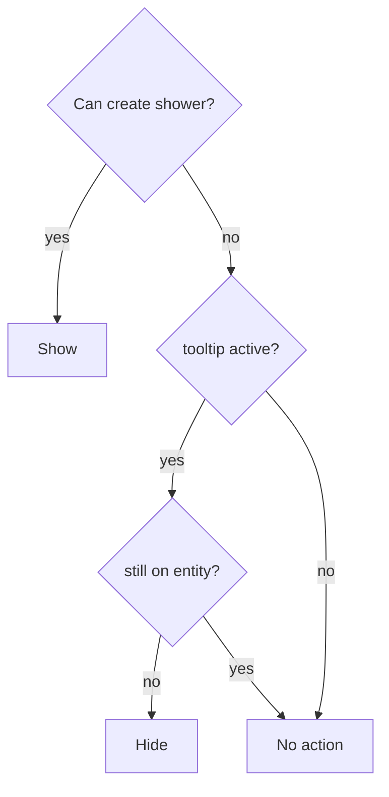
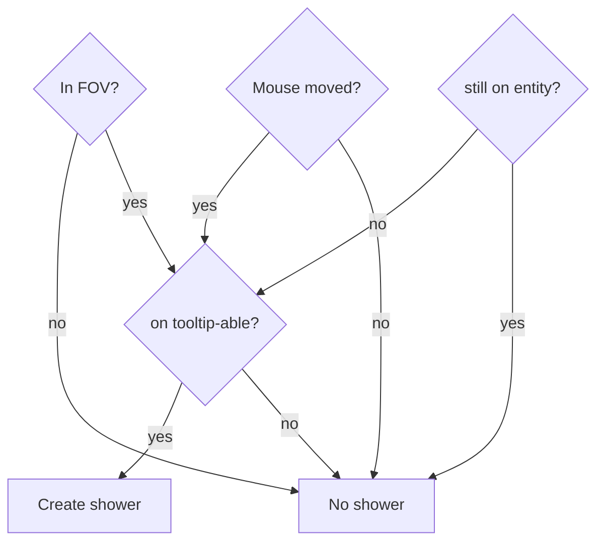

# Tooltip

The system to display a [tooltip](./tooltips.rs) is non-trivial. To determine whether a tooltip should be shown, hidden or left as-is, it must consider the following conditions:

- **Shown?** Is a tooltip already being displayed?
- **Mouse pos?** Is the mouse cursor over the game viewport (as opposed to being entirely off the game window).
- **In FOV?** Is the mouse cursor over a tile within the local player's field of view? Remember the FOV can change if the player moves or if the tooltipped entity moves.
- **Still on entity?** Is the mouse cursor over the entity for which the tooltip is being shown?
- **Mouse moved?** Has the mouse cursor moved? If not, we can bail out early when no tooltip is being shown since we only one to activate a tooltip when the mouse moves over a relevant entity, and not when an entity moves under the mouse because either the entity moved or the camera moved.
- **On tooltip-able?** Is the mouse cursor hovering over an entity with a `TooltipLabel` component?

We use two key components:

- `TooltipLabel`. This marks entities that support tooltips. It contains the tooltip label to use.
- `TooltipUI`. This marks the entity that displays the actual tooltip for entities with a `TooltipLabel` component. So we only have a single `TooltipUI` entity in the game and it itself lacks a `TooltipLabel`, while we have many entities with a `TooltipLabel` component (e.g the players, monsters, items, and anything else we want to tooltip).

The `tooltip` system delegates to the following constructs:

- `TooltipDeterminerBuilder`, which focuses on gathering and packaging all the conditions to test and then building a `TooltipDeterminer`.
- `TooltipDeterminer`, which tests the conditions to determine the `TooltipToggleAction` enum.
- `TooltipToggleAction` has the following variants:
  - `Hide`, which contains the `TooltipHider`, used to hide or deactivate the active tooltip.
  - `None`, which indicates no toggling is needed.
  - `Show`, which contains the `TooltipShower`, used to display or activate the tooltip at the proper location.

To determine if and how to toggle a tooltip, we take this decision flow:

Logic to determine whether we can create a `TooltipShower`:

Notes:

- Part of the reason for this breakdown is to defer the check on whether the mouse is over a tooltip-able entity as much as possible, since my assumption is that this is the most expensive (since it has to check all entities that have `TooltipLabel` and check their position relative to the mouse position etc.). Whereas the other conditions are presumably much cheaper.
- The coordinate systems are tricky, since we have to deal with 3:

  - **Game**. The 2D game coordinates is where the tooltip-able and player entities live and where we use the `PlayerCamera`. The origin here is in the center and the scale may differ.
  - **Screen**. The mouse cursor coordinates are unrelated to the `PlayerCamera`'s scale and have an origin at the top left.
  - **HUD**. The HUD coordinates are based on the `HudCamera`, which is also independent of the `PlayerCamera` and I think the origin is at the bottom left.
