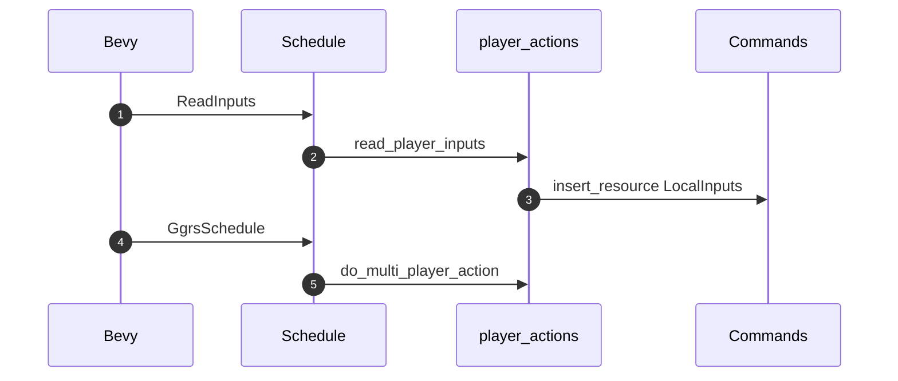
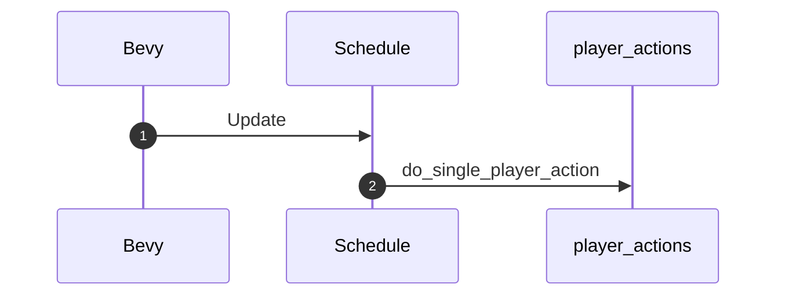
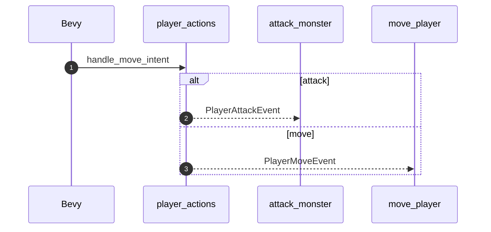
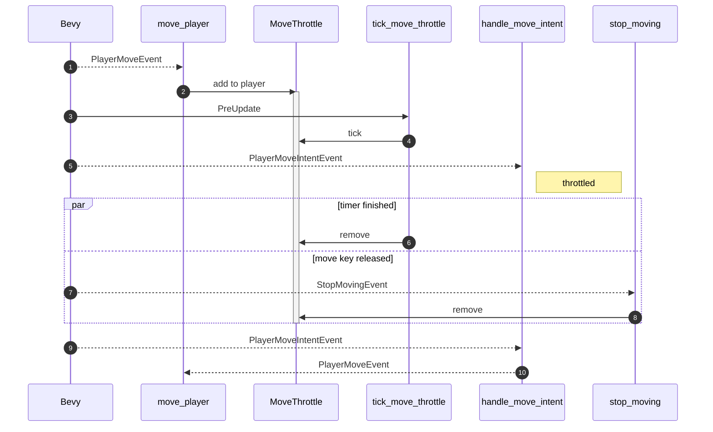

# Player Actions

- Move up,down,left,right
- Commands like save state snapshot
- Grab item
- Use item (keys 1-0)

Flow is: read keyboard input -> encode into action enum ->
in ggrs can try to send across as enum (try with repr(u8) and derive FromPrimitive)
in sp mode, just use enum directly

## MultiPlayer (and SyncTest)

1. Bevy runs the GGRS `ReadInputs` schedule
2. `ReadInputs` runs the [read_player_inputs](./read_player_inputs.rs) system which reads keyboard inputs and determines the resulting `PlayerAction`, which is then encoded into a `u8` (byte) as expected by `GgrsSessionConfig`.
3. `read_player_input` then stores that into the GGRS `LocalInputs` resource so that GGRS makes it available to all players (local and remote) via the `PlayerInputs` resource.
4. Bevy then runs the GGRS `GgrsSchedule` which starts by running [do_multi_player_action](./do_multi_player_action.rs). `do_multi_player_action` decodes the `PlayerAction` from the `u8` obtained from `PlayerInputs` and writes the relevant event (if any) for each player. This is equivalent to `do_single_player_action` when running in SinglePlayer GameMode.

## SinglePlayer

1. Bevy runs the `Update` schedule
2. `Update` runs the [do_single_player_action](./do_single_player_action.rs) system which reads keyboard inputs, determines the resulting `PlayerAction` and writes the relevant event (if any) for the player. This is equivalent to `do_multi_player_action` combined with the `ReadInputs` schedule, since there is no need to synchronize player actions across multiple players.

## PlayerMoveIntentEvent

1. [handle_move_intent](./handle_move_intent.rs) determines whether the requested move is valid and wether it results in a simple move or a monster attack.
2. `handle_move_intent` dispatches a `PlayerAttackEvent` for a monster attack, which is handled by [attack_monster](./attack_monster.rs).
3. `handle_move_intent` dispatches a `PlayerMoveEvent` for a simple move, which is handled by [move_player](./move_player.rs)

### Key Input Throttling

When moving, we want the player to move in discrete units corresponding to dungeon positions (tiles) so it is easy to align with corridors, items etc. We want to allow fast movement, but also fine movement. So we start moving on key press (rather than release), BUT we need to throttle the key press since a short press tends to result in multiple move events.

1. A `PlayerMoveEvent` is read by `move_player`
2. `move_player` moves the player and also adds a `MoveThrottle` component to the `Player` entity. `MoveThrottle` encapsulates a timer.
3. On the `PreUpdate` schedule, Bevy runs `tick_move_throttle`
4. `tick_move_throttle` ticks (i.e. advances) the `MoveThrottle` timer. In this example, it has not yet finished, so nothing else happens.
5. A `PlayerMoveIntentEvent` is dispatched (because, say, the player is still pressing the same move key). `handle_move_intent` ignores this move because the player has a `MoveThrottle` component.
6. One way the `MoveThrottle` component is removed is on a call to `tick_move_throttle` that notices the timer has finished and removes it from the player.
7. Another way is when the player releases the move key, which results in Bevy mediating a `StopMovingEvent` (thanks to the `do_*_player_action` system).
8. In this second case, the `stop_moving` system will remove `MoveThrottle`.
9. Whether the throttle finished and the player is still pressing the key, or the player released the key and pressed it (or another move key), the next `PlayerMoveIntentEvent` will be sent.
10. And in this case `handle_move_intent` will turn it into a `PlayerMoveEvent` (or an attack etc)
