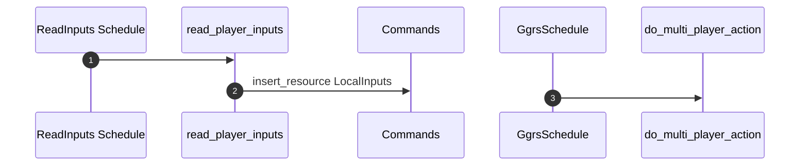

# Player Actions

- Move up,down,left,right
- Commands like save state snapshot
- Grab item
- Use item (keys 1-0)

Flow is: read keyboard input -> encode into action enum ->
in ggrs can try to send across as enum (try with repr(u8) and derive FromPrimitive)
in sp mode, just use enum directly

Then 2 options:

1. Given the enum, delegate to handlers that handle the action
2. Given the enum, write events for the various actions

## MultiPlayer (and SyncTest)

## SinglePlayer
