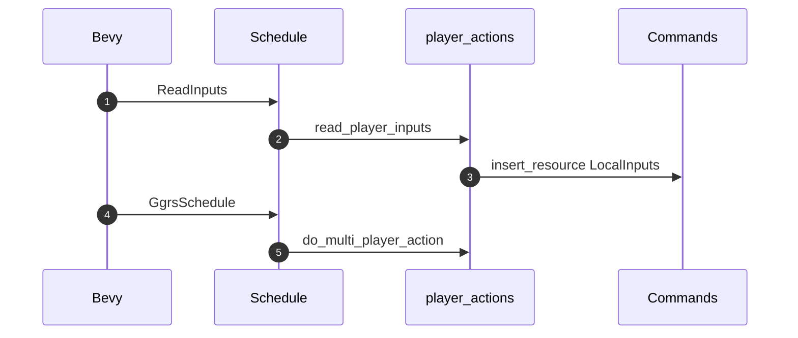
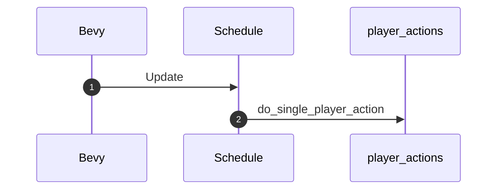
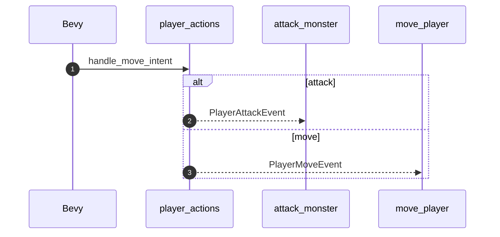

# Player Actions

- Move up,down,left,right
- Commands like save state snapshot
- Grab item
- Use item (keys 1-0)

Flow is: read keyboard input -> encode into action enum ->
in ggrs can try to send across as enum (try with repr(u8) and derive FromPrimitive)
in sp mode, just use enum directly

Then 2 options:

1. Given the enum, delegate to handlers that handle the action
2. Given the enum, write events for the various actions

## MultiPlayer (and SyncTest)

1. Bevy runs the GGRS `ReadInputs` schedule
2. `ReadInputs` runs the [read_player_inputs](./read_player_inputs.rs) system which reads keyboard inputs and determines the resulting `PlayerAction`, which is then encoded into a `u8` (byte) as expected by `GgrsSessionConfig`.
3. `read_player_input` then stores that into the GGRS `LocalInputs` resource so that GGRS makes it available to all players (local and remote) via the `PlayerInputs` resource.
4. Bevy then runs the GGRS `GgrsSchedule` which starts by running [do_multi_player_action](./do_multi_player_action.rs). `do_multi_player_action` decodes the `PlayerAction` from the `u8` obtained from `PlayerInputs` and writes the relevant event (if any) for each player. This is equivalent to `do_single_player_action` when running in SinglePlayer GameMode.

## SinglePlayer

1. Bevy runs the `Update` schedule
2. `Update` runs the [do_single_player_action](./do_single_player_action.rs) system which reads keyboard inputs, determines the resulting `PlayerAction` and writes the relevant event (if any) for the player. This is equivalent to `do_multi_player_action` combined with the `ReadInputs` schedule, since there is no need to synchronize player actions across multiple players.

## PlayerMoveIntentEvent

1. [handle_move_intent](./handle_move_intent.rs) determines whether the requested move is valid and wether it results in a simple move or a monster attack.
2. `handle_move_intent` dispatches a `PlayerAttackEvent` for a monster attack, which is handled by [attack_monster](./attack_monster.rs).
3. `handle_move_intent` dispatches a `PlayerMoveEvent` for a simple move, which is handled by [move_player](./move_player.rs)
